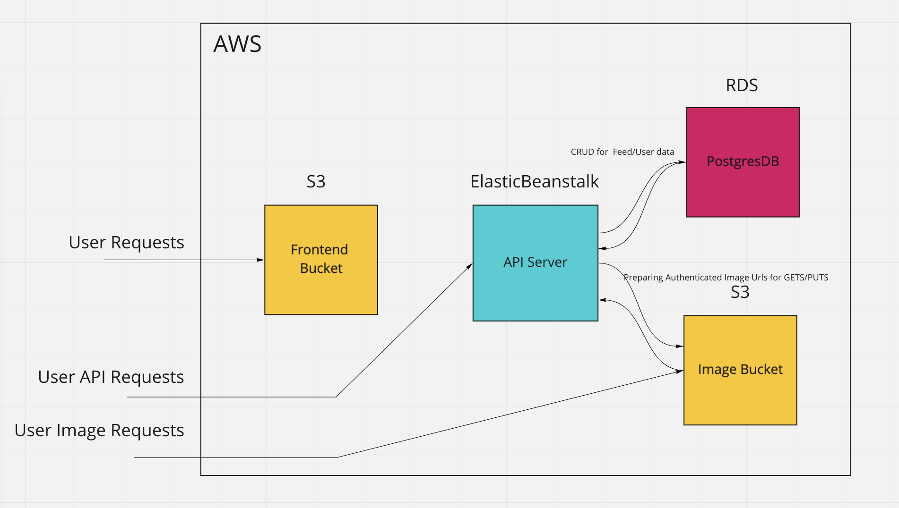

# Infrastructure

##Diagram

### Amazon Web Services (AWS)

#### Elastic Beanstalk (ELB)

The API code is pushed to Elastic Beanstalk

API: http://udagram-api-dev22222.us-east-1.elasticbeanstalk.com/

#### S3 Bucket (Frontend)

The frontend is hosted on a publicly accessible S3 bucket.

Frontend: http://c-udagram-1.s3-website-us-east-1.amazonaws.com/home

The images are hosted within a second s3 bucket

Image Bucket: c-img-1

#### RDS
A postgres database is running within RDS for the backed to utilize.

Postgres: database-1.c6gsons6umxe.us-east-1.rds.amazonaws.com
