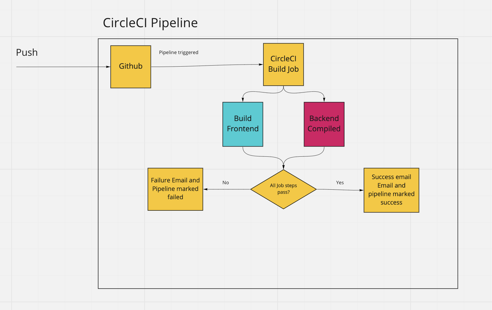

# Pipeline

This project utilizes CircleCI for its CI/CD

The following environment variables are required in CircleCI
POSTGRES_USERNAME=
POSTGRES_PASSWORD=
POSTGRES_DB=
POSTGRES_HOST=
PORT=
AWS_ACCESS_KEY_ID=
AWS_BUCKET=
JWT_SECRET=
NODE_OPTIONS=--openssl-legacy-provider
URL=
AWS_SECRET_KEY=
AWS_SECRET=

When code is pushed to any branch CircleCI will dynamically pull build and push the code to AWS

Frontend Deployment
Once the code is complied in CircleCI it is pushed to the S3 bucked defined within bin/deploy.sh within the UI code folder.

API Server
Once the code is compiled in CircleCI it is pushed to EB app/environment that is defined in .elasticbeanstalk/config.yml within the API code folder. Additionally the RDS and Image bucket which the API server will use are defined as enviroment variables passed into CircleCI

##Diagram

